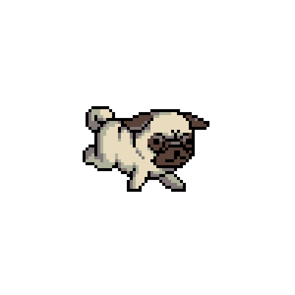
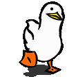

<!--first-gif-->

<!--profile-->
 <h1 align="center">Hello World </h1>
 
Welcome to my github!
  
  I'm Thiago Henrique, Front-End developer and
 passionate about games and programming.
   
 
 

 
 <!-- github -->
 

    <a href="https://github.com/ythiago03">
  
 

 
 <!-- icons -->

 
   
   
    

  <!--pato-->
  

 <!--about-->
 <h2> About me</h2>
 
 <ul>
     <li> 👨🏻‍💻 I'm looking for an internship as a front-end developer</li>
     <li>🌱 I am currently studying JS, HTML, CSS, REACT and APIs</li>
  
 </ul>
 <!--contact-->
  

     
 
  

 <!--snake-->
 

